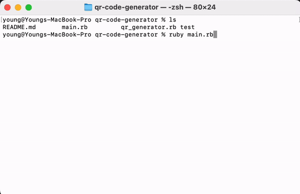

# QR Code Generator

The QR Code Generator is a Ruby script that allows you to create QR codes with custom URLs, colors, sizes, and file names. This tool is perfect for generating QR codes for websites, products, promotions, and more.

### Demo

## Features

- Set custom URLs for QR codes.
- Customize the QR code and background colors from a predefined color list.
- Specify the size of the QR code image.
- Define a custom file name for the generated QR code image.

### Options

- **1. Enter the URL**: Set the URL you want the QR code to link to. It must start with `http` or `https`.

- **2. Enter the color of the code**: Customize the color of the QR code itself. A list of available colors will be displayed.

- **3. Enter the color of the background**: Choose a background color from the same list of available colors.

- **4. Enter the size of the QR code image**: Specify the size (in pixels) of the QR code image.

- **5. Enter the image file name**: Define a custom file name for the generated QR code image. The `.png` extension will be added automatically.

- **6. Generate!**: After setting all the options, select this to generate your QR code.

- **7. Exit**: Exit the QR Code Generator.

